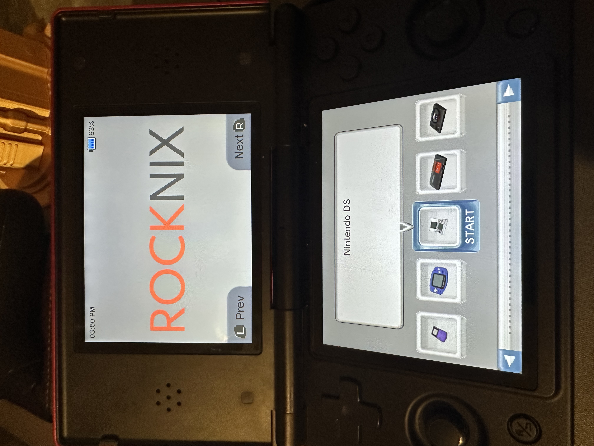
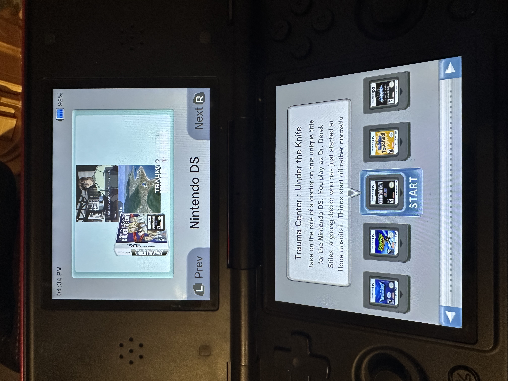

# DII-ESS-AYE
A janky emulationstation theme for ROCKNIX meant to make the Anbernic RG DS or AYN Thor feel a bit more like a chunky DSi.

## Known Issues (that won't be fixed)
1. Keyboard and horizontally longer popups are incorrectly sized.
2. Advanced Game Options is hidden.
  - Workaround by pressing your Advanced Game Options button twice.
3. Slider setting bars are way too long.

# Install
1. Download or clone this repository
2. Copy the contents of this repository into your themes folder under a folder named `dii-ess-aye`
  - Either connect to your network share and put it in the `themes` folder
  - Or copy it to `/STORAGE/.config/emulationstation/themes/` directly
3. Copy only the enable script for your device from the repository's `scripts` folder into your `roms/ports` folder
  - !!! NOTE: If you downloaded the theme as a zip, you may need to re-enable execution on the `enable_theme_*.sh` script either
              after extraction on your computer or on the device via ssh. Use `chmod +x enable_theme_*.sh` for either method.
4. After updating your gamelists, open your ports section on your device and
  - Either run the enable script every time you want to enable the theme
    - (You will have to manually change the theme setting when you want to switch back)
  - Or set the enable script to run at launch by opening the Advanced Game Options and turning on that option
    - Optionally, set the enable script's metadata Hidden option if you don't want it to clutter the ports
5. Enjoy?

# Uninstall
1. If your enable script is set to auto start: Start Menu -> System Settings -> Frontend Developer Options -> Stop Running This Game At Startup
2. Switch your theme back to SYSTEM-THEME: Start Menu -> User Inferface Settings -> Theme Set
3. Reboot
4. If your enable script is hidden either manually delete the script completely from `/roms/ports`, or
  1. Go to Start Menu -> User Interface Settings -> Enable Show Hidden Files
  2. Go to your Ports section in EmulationStation and highlight the script
  3. Press X -> Edit This Game's Metadata -> Select the DELETE button at the bottom
  4. Say "Yeah man, I wanna do it."
5. Enjoy no longer...

# Scraping Recommendations
I recommend using Skraper and setting it to:
- Generate a gamelist.xml
- Scrape a miximage, linked to `<image>` node
- Scrape a support texture, resized to a square resolution, linked to `<thumbnail>` node
- (Optional) Scrape a video, linked to `<video>` node

If you already have a scraped collection, and just want to make it look okay enough with this theme
there are additional thumbnail scripts provided in the `scripts/thumbnails` directory of this repository
that can automatically crop (hard cut to 256x256), squish (preserves image, compresses to fit 256x256),
or resize (preserves image and aspect ratio, shrinks to 256x256) your existing boxart or support textures.
These can be run on your device after all gamelists, games, and images are in place.

# Special Thanks!
- Ant (https://github.com/anthonycaccese) for the status and slot icons and their implementation.
- Jeod (https://github.com/JeodC) for help testing the Thor variant.
- Zoidburg13 (https://github.com/Zoidburg13) for their wonderful system icons. 

# Previews
 
